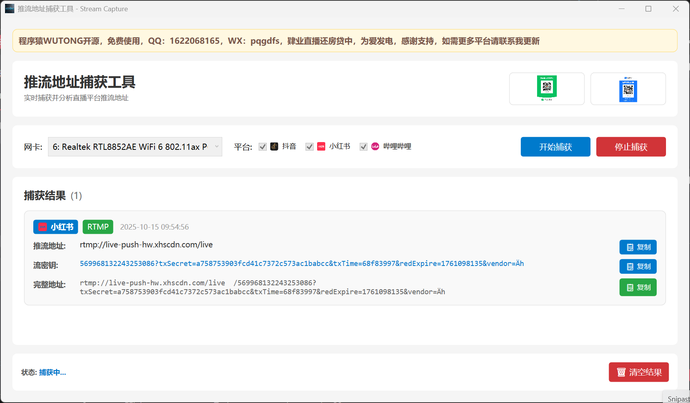
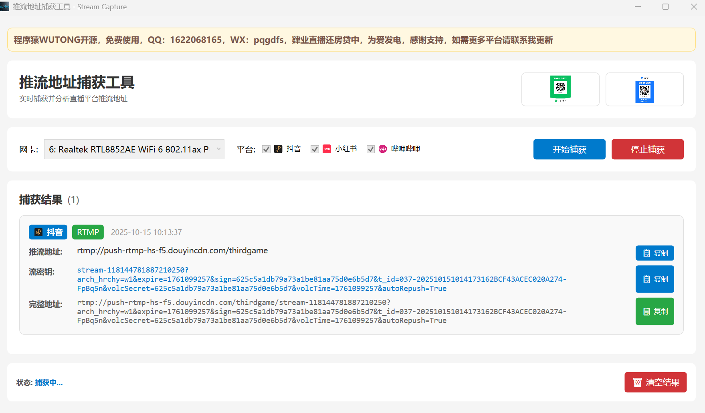

# 推流地址捕获工具 - 使用说明

仅保留必需的使用步骤，便于快速上手。本工具用于捕获并显示抖音/小红书/B站等平台的推流地址与密钥。

## 环境要求

- Windows 10/11（建议管理员权限运行）
- 已安装 Npcap（WinPcap 兼容模式）
  - 下载: [Npcap 官方站点](https://npcap.com/#download)
## 允许截图
- 小红书

- 抖音

## 支持的平台

- 当前支持：
  -  抖音
  -  小红书
  -  哔哩哔哩

- 计划支持：
  -  快手
  - 视频号

## 运行步骤

1. 启动应用后，选择网卡（通常为正在上网的有线/无线网卡）。
2. 平台默认全选，直接点击“开始捕获”。
3. 打开直播软件/客户端开始推流（如抖音/小红书/B站直播姬）。
4. 回到本工具，等待结果出现：
   - 推流地址（如 rtmp[s]://.../live-bvc）
   - 流密钥（形如 live_xxx?key=...）
   - 可一键复制“推流地址/流密钥/完整地址”。
5. 完成后点击“停止捕获”。

## 常见问题

- 看不到网卡：请确认已安装 Npcap，并以管理员身份运行。
- 无结果：先启动抓包，再开启直播；确认平台被支持且走 RTMP/RTMPS/RTMPSRT。

## 支持作者

为爱发电，持续更新中（得有人愿意使用），如本工具对你有帮助，欢迎赞赏支持（谢谢！）。作者肄业还房贷，为爱发电中，您的支持是我持续维护更新的动力。

| 微信 | 支付宝 |
| --- | --- |
|  |  |

— 仅供学习研究使用，请勿用于商业或非法用途。

